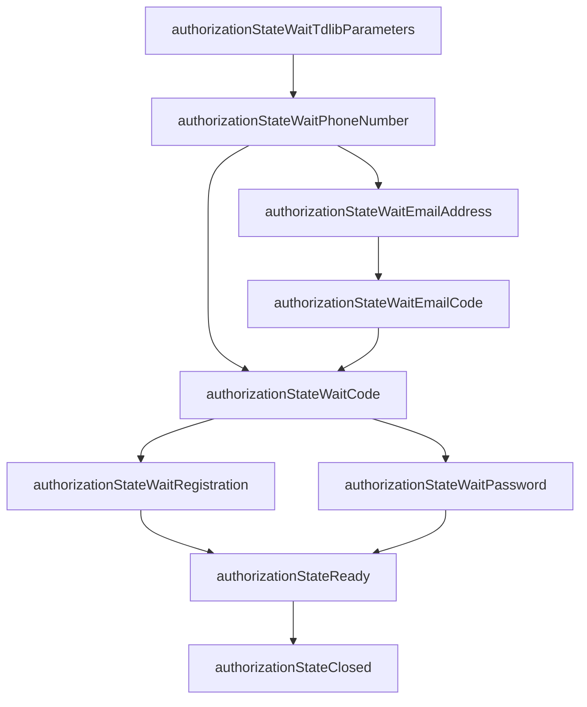

TDLib manages authentication through a state machine. Every time the authorization state changes, TDLib sends an `updateAuthorizationState` update. Your application must listen for these updates and respond with the appropriate request until the client reaches `authorizationStateReady`.

<Note>
  You must obtain your own `api_id` and `api_hash` from [my.telegram.org](https://my.telegram.org) before building any TDLib application. The values used in example code are for demonstration only and must not be used in production.
</Note>

## Getting your API credentials

<Steps>
  <Step title="Log in to my.telegram.org">
    Visit [my.telegram.org](https://my.telegram.org) and sign in with your Telegram phone number.
  </Step>
  <Step title="Create an application">
    Go to **API development tools** and fill in the form. You can use any application name and platform.
  </Step>
  <Step title="Copy your credentials">
    After submitting, copy the `api_id` (an integer) and `api_hash` (a hex string). Store them securely — treat `api_hash` like a password.
  </Step>
</Steps>

## The authorization state machine

TDLib signals each step of authentication by sending `updateAuthorizationState`. The `authorization_state` field of the update contains an object whose `@type` identifies the current state. You must handle each state and send the corresponding request.



## Handling each state

<Steps>
  <Step title="authorizationStateWaitTdlibParameters">
    The first state TDLib enters. Send `setTdlibParameters` with your application settings and API credentials.

    ```python tdjson_example.py
    elif auth_type == "authorizationStateWaitTdlibParameters":
        self.send(
            {
                "@type": "setTdlibParameters",
                "database_directory": "tdlib_data",
                "use_message_database": True,
                "use_secret_chats": True,
                "api_id": self.api_id,
                "api_hash": self.api_hash,
                "system_language_code": "en",
                "device_model": "Python TDLib Client",
                "application_version": "1.1",
            }
        )
    ```
  </Step>

  <Step title="authorizationStateWaitPhoneNumber">
    TDLib needs the user's phone number. Send `setAuthenticationPhoneNumber` in international format (e.g. `+12025550147`).

    For bot authorization, send `checkAuthenticationBotToken` instead — see [Bot authorization](#bot-authorization) below.

    ```python tdjson_example.py
    elif auth_type == "authorizationStateWaitPhoneNumber":
        phone_number = input(
            "Please enter your phone number (international format): "
        )
        self.send(
            {
                "@type": "setAuthenticationPhoneNumber",
                "phone_number": phone_number,
            }
        )
    ```
  </Step>

  <Step title="authorizationStateWaitEmailAddress">
    Some accounts require email verification before the SMS code step. Send `setAuthenticationEmailAddress` with the user's email.

    ```python tdjson_example.py
    elif auth_type == "authorizationStateWaitEmailAddress":
        email_address = input("Please enter your email address: ")
        self.send(
            {
                "@type": "setAuthenticationEmailAddress",
                "email_address": email_address,
            }
        )
    ```
  </Step>

  <Step title="authorizationStateWaitEmailCode">
    TDLib sent a code to the email address. Send `checkAuthenticationEmailCode` with the code the user received.

    ```python tdjson_example.py
    elif auth_type == "authorizationStateWaitEmailCode":
        code = input(
            "Please enter the email authentication code you received: "
        )
        self.send(
            {
                "@type": "checkAuthenticationEmailCode",
                "code": {
                    "@type": "emailAddressAuthenticationCode",
                    "code": code,
                },
            }
        )
    ```
  </Step>

  <Step title="authorizationStateWaitCode">
    Telegram sent an authentication code via SMS, a phone call, or another active Telegram session. Send `checkAuthenticationCode` with the code.

    ```python tdjson_example.py
    elif auth_type == "authorizationStateWaitCode":
        code = input("Please enter the authentication code you received: ")
        self.send({"@type": "checkAuthenticationCode", "code": code})
    ```
  </Step>

  <Step title="authorizationStateWaitRegistration">
    The phone number is not registered with Telegram. Collect the user's name and send `registerUser`.

    ```python tdjson_example.py
    elif auth_type == "authorizationStateWaitRegistration":
        first_name = input("Please enter your first name: ")
        last_name = input("Please enter your last name: ")
        self.send(
            {
                "@type": "registerUser",
                "first_name": first_name,
                "last_name": last_name,
            }
        )
    ```
  </Step>

  <Step title="authorizationStateWaitPassword">
    The account has two-step verification enabled. Send `checkAuthenticationPassword` with the user's cloud password.

    The state object includes a `password_hint` field you can display to the user, and a `has_recovery_email_address` flag if recovery is available.

    ```python tdjson_example.py
    elif auth_type == "authorizationStateWaitPassword":
        password = input("Please enter your password: ")
        self.send(
            {"@type": "checkAuthenticationPassword", "password": password}
        )
    ```
  </Step>

  <Step title="authorizationStateReady">
    The client is fully authenticated. TDLib is now ready to accept all requests and will begin delivering updates.

    ```python tdjson_example.py
    elif auth_type == "authorizationStateReady":
        print("Authorization complete! You are now logged in.")
        return
    ```
  </Step>

  <Step title="authorizationStateClosed">
    The TDLib client has shut down completely. All databases are closed and all resources released. To reconnect, create a new client instance.

    ```python tdjson_example.py
    if auth_type == "authorizationStateClosed":
        print("Authorization state closed.")
        break
    ```
  </Step>
</Steps>

## Full authentication loop

The example below shows the complete receive loop used to drive the state machine:

```python tdjson_example.py
def _handle_authentication(self) -> None:
    """Handle the TDLib authentication flow."""
    while True:
        event = self.receive()
        if not event:
            continue

        event_type = event["@type"]

        if event_type == "updateAuthorizationState":
            auth_state = event["authorization_state"]
            auth_type = auth_state["@type"]

            if auth_type == "authorizationStateClosed":
                break

            elif auth_type == "authorizationStateWaitTdlibParameters":
                self.send({
                    "@type": "setTdlibParameters",
                    "database_directory": "tdlib_data",
                    "use_message_database": True,
                    "use_secret_chats": True,
                    "api_id": self.api_id,
                    "api_hash": self.api_hash,
                    "system_language_code": "en",
                    "device_model": "Python TDLib Client",
                    "application_version": "1.1",
                })

            elif auth_type == "authorizationStateWaitPhoneNumber":
                phone_number = input("Phone number (international format): ")
                self.send({
                    "@type": "setAuthenticationPhoneNumber",
                    "phone_number": phone_number,
                })

            # ... handle remaining states

            elif auth_type == "authorizationStateReady":
                return
```

## Bot authorization

To authorize a bot, send `checkAuthenticationBotToken` when TDLib reaches `authorizationStateWaitPhoneNumber`. Pass the token you received from [@BotFather](https://t.me/BotFather).

```python bot_auth.py
elif auth_type == "authorizationStateWaitPhoneNumber":
    self.send({
        "@type": "checkAuthenticationBotToken",
        "token": "123456:ABC-DEF1234ghIkl-zyx57W2v1u123ew11",
    })
```

<Tip>
  Bots skip the SMS code, email, registration, and password states. After `checkAuthenticationBotToken` succeeds, TDLib transitions directly to `authorizationStateReady`.
</Tip>

## Additional authorization options

<AccordionGroup>
  <Accordion title="QR code authentication">
    Call `requestQrCodeAuthentication` when in `authorizationStateWaitPhoneNumber` to receive a `authorizationStateWaitOtherDeviceConfirmation` update containing a `tg://` link. Display it as a QR code for the user to scan with another logged-in Telegram client.
  </Accordion>

  <Accordion title="Logging out">
    Call `logOut` from any state after `authorizationStateReady`. TDLib will transition through `authorizationStateLoggingOut` → `authorizationStateClosing` → `authorizationStateClosed`.
  </Accordion>

  <Accordion title="Password recovery">
    If the user forgets their two-step verification password, call `requestAuthenticationPasswordRecovery` to send a recovery code to the user's recovery email, then call `recoverAuthenticationPassword` with the code.
  </Accordion>
</AccordionGroup>

## Related

<CardGroup cols={2}>
  <Card title="Updates" icon="bell" href="/concepts/updates">
    Understand how TDLib delivers updateAuthorizationState and other real-time events.
  </Card>
  <Card title="Encryption and storage" icon="database" href="/concepts/encryption-storage">
    Configure the database directory and encryption key passed in setTdlibParameters.
  </Card>
</CardGroup>
